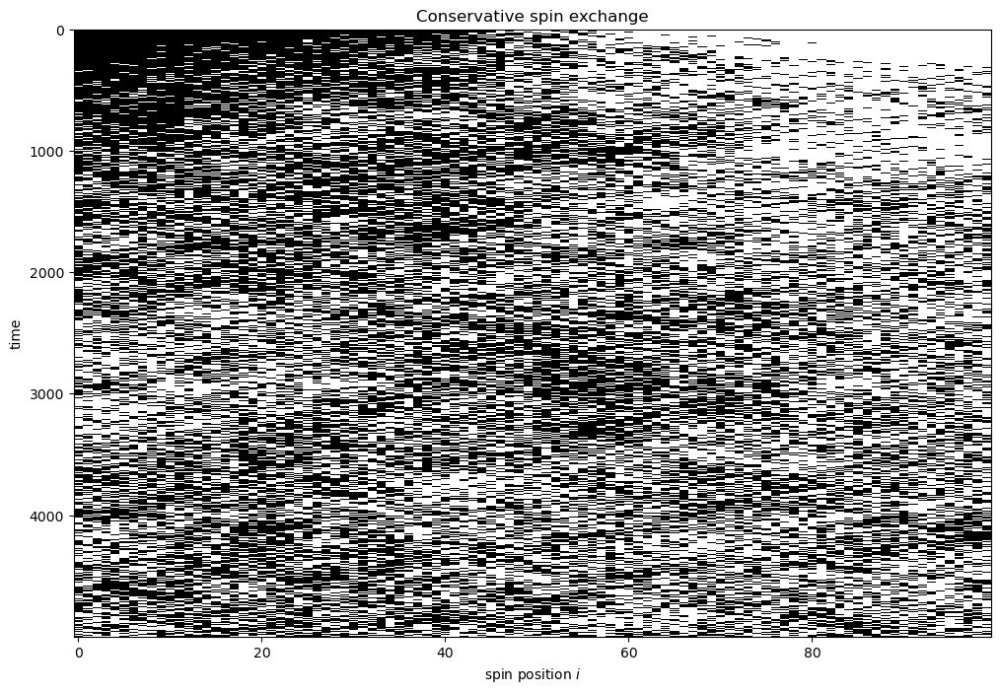

## Quiz:
Find a formula for

$$
\log \left( { N \atop q}\right)
$$
when both are large, $N, q\to \infty$. , $q \le N$ 

Solution:

$$
\log \Omega = - N \left( p \log p + (1 - p) \log (1 - p)\right), \quad p = N/q
$$

We are spending these lectures making sense of the fundamental assumption of statistical mechanics:

"In an isolated system in thermal equilibrium, all accessible microstates are equally probable."

Lecture 5 was all about microstates, macrostates, and probability. In this lecture, we'll think a bit more about these things, and also give some more context for what *accessible* means. 

## Interacting Systems

Interactions place constraints on systems, and force us to really think about what microstates are accessible to a system.  

The book has a treatment of the einstein solid. As a complement, I'll consider two paramagnets. You can think of each magnet as a chain with a total energy

$$
E = -{\bf m}\cdot {\bf B}
$$
This is the energy of a magnetic dipole moment ${\bf m}$  in a magnetic field $B$. For a spin chain like we discussed previously in class, the magnet moment of the entire system is the sum of individual dipole moments

$$
{\bf m} =  \sum_{i = 1}^{N} {\bf m}_{i}
$$
A simple model of spins assumes that there are only two orientations, aligned or anti-aligned with the magnetic field:

$$
{\bf m}_{i} \cdot {\bf B} = m_{0} B s_{i}, \quad s_{i} \in \{ \pm 1\}
$$

Then the total energy is

$$
E = - m_{0} B \sum_{i = 1}^{N} s_{i} = - E_{0} M,
$$
where I've introduced for shorthand the unit of energy per particle $E_{0}= m_{0} B$, and the integer-valued magnetization

$$
M = \sum_{i = 1}^{N} s_{i}
$$
Now consider two spin chains, each with $N/2$ spins, and with differential initial energies, brought into contact.  I will refer to them as left (L) and right (R). The left chain is initially totally magnetized up, i.e. $M_{L} = N/2$ , so the energy is

$E_{L} = -E_{0} (N/2)$

the right chain is initially totally down, so $M_{R} = - N/2$, and 

$E_{R} = E_{0} N/2$

Now let's bring them into contact, and allow them to interact, but in such a way as to preserve the total energy, like typical closed systems do. In other words,  $E = E_{L} + E_{R}$ is a constant. A particular interaction that makes sense is a local interaction, where spins pointing in opposite directions try to align with each other, and as a result both flip. I will call this a spin exchange interaction. For instance, if two neighboring spins have the orientation $(-1, +1)$ in one time step, then in the next time step they will flip to  $(+1, -1)$. This doesn't change the total magnetization, and thus keeps the energy invariant. 

In the first figure below, I plot the spin orientation with black ($+1$) and white ($-1$). At $t = 0$, the left chan is all black, and the right chain is all white. At each time step, I select a pair of neighboring spins randomly, and if they are anti-aligned I flip both spins. If they are aligned, I do nothing. In this way, the spin orientations start to mix throughout the two subsystems.

In the next plot, we show the total magnetization of the left chain and the right chain as time progresses. As seen, despite the total magnetization being constant, the spin exchange interaction mixes the two subsystems and eventually brings their subsystem magnetization close to zero, with some fluctuations. 

(To run these simulations yourself, you can visit the google colab notebook [Spin Exchange Thermalization](https://drive.google.com/file/d/1Hu2bnGyWk2UQ_JjLz7_0ogqq_SvYyYfW/view?usp=sharing) If you want to make edits, you'll have to download a copy and work on that.)

The important point here is that we essentially have a choice of how to define macrostates. Since we began with two subsystems, it is most natural to consider the macrostate of the composite system using two coordinates $(M_{L}, M_{R})$ describing the macrostate for each. However, since there are interactions, we know the two macrostates cannot be chosen independently, but rather must satisfy the constraint

$$
M_{L}+ M_{R} = M_{L}^{0} + M_{R}^{0} = 0
$$
where I have written $M_{L/R}^{0}$ to denote the initial magnetization. In my simulation, I assumed that their sum was zero. 

Let's try to understand this behavior using the language of Schroeder and accessible states. 
For concreteness, let's assume $N = 6$. In our model, the total energy, and thus magnetization, is conserved, and the initial magnetization is $M= 0$. But that is composed of two systems

$$
M = M_{L} + M_{R}
$$

### Q1:
What are the possible macrostates of this composite system?

$(M_{L}, M_{R}) = (3, -3), (1, -1), (-1, 1), (-3, 3)$

Each of these must satisfy the constraint of zero total magnetization.

Next, let's think about the microstates. Recall the formula

$$
\Omega(M) = \left( { N \atop \frac{1}{2} ( N - M)}\right)
$$

## Q2:
What is the multiplicity of each macrostate? What is it generally?

For concreteness, $N = 3$ for the subsystem

$$
\Omega(3) = \left( { 3 \atop 0} \right) = 1, \quad \Omega(1) = \left( { 3 \atop 1} \right) = 3
$$

Then
$$
\Omega(M_{L} = 3, M_{R} = -3) = \Omega(M_{L} = 3) \Omega(M_{R} = -3) = 1 
$$

$$
\Omega(M_{L} = 1, M_{R} = -1) = \Omega(M_{L} = 1) \Omega(M_{R} = -1) = 3 \times 3 = 9 
$$

In general, we get

$$
M = M_{L} + M_{R} = 0
$$
and 

$$
\Omega(M_{L}, M_{R}) = \Omega(M_{L}) \Omega(M_{R}) = \Omega(M_{L}) \Omega(M - M_{L})
$$

### The Law of maximizing multiplicity

Now since all microstates are equally probable, the macrostate that wins is the one with the most microstates. We can find this in the problem above. The macrostate is labeled by a single number, $M_{L}$, which we can vary until the multiplicity is maximized. However, it's much easier to maximize the log of the product, which we can do since log is monotonic. Then define

$$
H(M_{L}) = \log \left(\Omega(M_{L}) \Omega(M - M_{L}) \right) = \log \Omega(M_{L}) + \log \Omega(M - M_{L})
$$

This is in fact the second law of thermodynamics. The object I've introduced is just the entropy $S = k_{B} H$. In this formulation, the second law states that equilibrium, and the macrostates that produce it, corresponds to the state of maximum multiplicity.
